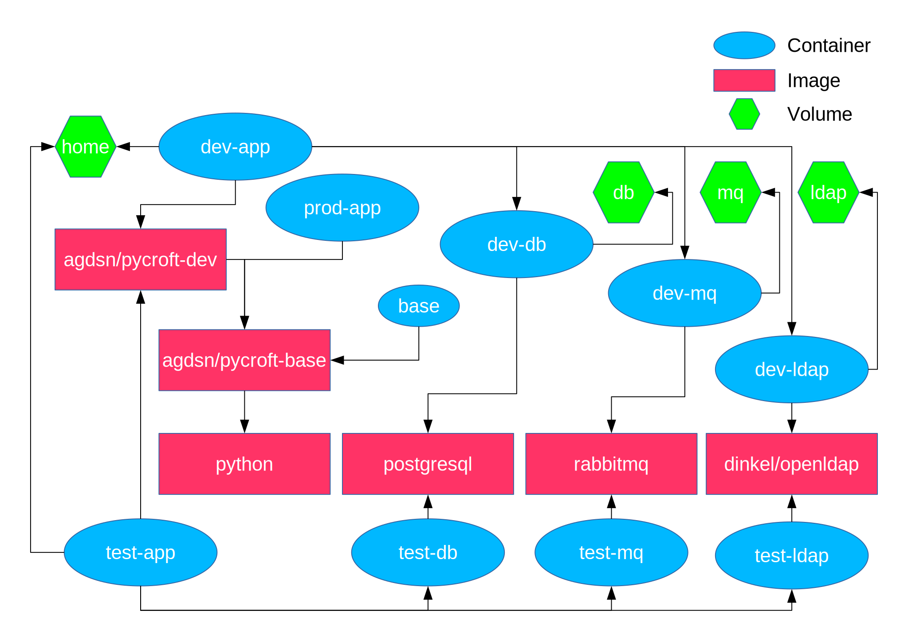

# About #

Pycroft is the future user management system of the AG DSN student
network.  It is based on [Flask](http://flask.pocoo.org) and expects a
[Postgres](https://www.postgresql.org/) database making use of the
[SQLAlchemy ORM](http://www.sqlalchemy.org/).

# Cloning this directory #

A basic understanding of [git](https://git-scm.com/) is advisable.
The first step should be to clone this repository via `git clone
<url>`, using what clone url shows you above
[this very readme](https://github.com/agdsn/pycroft)

# Setup #

An easy way of doing the setup is by using docker-compose.

## Installing Docker and docker-compose ##

Follow the
guides [here](https://www.docker.com/community-edition#download)
and [here](https://docs.docker.com/compose/install/).
You will need at least docker engine `17.06.0+` and a docker compose `1.16.0+`.

Also, note that you might have to add your user to the `docker` group
for running docker as a non-root:

```sh
sudo usermod -aG docker $(whoami)
```

After adding yourself to a new group, you need to obtain a new session,
by e.g. logging out and in again.

You should now be able to run `docker-compose config` and see the
current configuration.

## Docker architecture ##

We provide three different container environments for the project:

* **dev**: Development environment. The container images contain helpful tools,
  the containers uses persistent volumes and your local project directory of your
  machine is mounted inside the container.
* **test**: Test environment. Almost identical to the development environment.
  Persistent volumes are replaces by *tmpfs* file systems for improved
  performance and ephemerality.
* **prod**: Production environment. Contains only what is required to run
  Pycroft without development tools.

For each environment a docker-compose file is provided.
The following diagram shows all services/containers, images and volumes at a
glance:



* A `base` service/container for creating the base image `agdsn/pycroft-base`
  based on the Debian variant of Docker's official Python image `python`.
  The service/container is not actually needed, it's only used to build the base
  image. The base image contains basic system software required to run Pycroft.
  A `pycroft` user and group with UID and GID specified as build arguments is
  created in the image.
  The UID and GID of this user should match with your user on your development
  machine, because the development service bind mounts the project directory on
  your local machine in the container.
  The home directory of the `pycroft` user is created user at `/opt/pycroft`.
  A
  [virtual environment (venv)](https://docs.python.org/3/library/venv.html) is
  created at `/opt/pycroft/venv` and automatically activated by the image's
  entrypoint.
* A `dev-app` service/container based on `agdsn/pycroft-dev` derived from
  `agdsn/pycroft-base`. The development image contains additional packages
  for development, e.g. `gcc`, `yarn`. The service uses two persistent volumes:
  * the home directory `/opt/pycroft` of the `pycroft` user, that contains among
    other things, the virtual environment, the pip cache, and the
    `.bash_history`.
  * the Pycroft sources on your local machine at `/opt/pycroft/app`.
* A `test-app` service/container based on the `agdsn/pycroft-dev` image, that
  runs unit and integration tests. The database tests are run against an
  optimized in-memory database.
* A `prod-app` service/container based on `agdsn/pycroft-prod`, which is based on
  `agdsn/pycroft-base` that contains only the basics that are required for
  running Pycroft without development tools, such as `gcc` or `yarn`.
  Pycroft and its dependencies are build using an instance of the
  `agdsn/pycroft-develop` image using the
  [multi-stage builds](https://docs.docker.com/develop/develop-images/multistage-build/)
  feature of Docker.
* A `dev-db` and `test-db` service/container based on the official `postgresql`
  image, that provides a development and test database respectively.
  The test database uses `tmpfs` for the data directory to improve performance.
  The dev database uses a persistent volume for the data directory.
* A `dev-ldap` and `test-ldap` service/container based on the `dinkel/openldap`
  image, that provides a development and test LDAP server respectively.
* A `dev-mq` and `test-mq` service/container based on the official `rabbitq`
  image, that provides a development and test message queue respectively.

The separate services for *dev* and *test* are mainly for isolation (you don't
want tests to affect your development instance and vice versa) and also
for performance (unit tests should be quick).
There are no `prod-` services for `db`, `ldap`, and `mq`, because the production
instances of these services are typically managed outside of Pycroft.

All services of the same type (**dev** and **test**) share the same network
namespace, i.e. you can reach the database server on `127.0.0.1` from `dev-app`
although it's running in a different container.

The services are put into different compose files for convenience:
* `docker-compose.base.yml`: Common definitions of services
* `docker-compose.dev.yml`: Development services
* `docker-compose.test.yml`: Test services
* `docker-compose.prod.yml`: Production services

The **dev** environment is default environment.
The default compose file `docker-compose.yml` is a symlink to
`docker-compose.dev.yml`.

## Defining `UID` and `GID`

To set the `UID` and `GID` build arguments of the `agdsn/pycroft-base` image
with `docker-compose`, use an `docker-compose` `.env` file:

```dotenv
UID=<your-uid>
GID=<your-gid>
```

An `.env` template is included as `example.env` in the project root.
Copy the example to `.env` and set the correct values for your user,
`docker-compose` will automatically pick up the contents of this file.
The example also includes other useful environment variables, such as
`COMPOSE_PROJECT_NAME`.

You can also use environment variables from your shell to specify the UID/GID
build arguments when invoking `docker-compose`.
The docker-compose files pass the `UID` and `GID` environment variables as build
arguments to docker.
Don't be fooled by your shell however by executing the following command and
feeling safe, if it outputs your UID:

```bash
echo $UID
```

Bash and zsh automatically define this variable, but do not export it:

```bash
python3 -c 'import os; print(os.getenv("UID"))'
```

You have to explicitly export the variable:

```bash
export UID
# Bash does not set GID, zsh does, so you can omit the assignment with zsh:
export GID=$(id -g)
```

You should put these lines somewhere in your shell's startup script (e.g.
`.profile` in your `$HOME`), so that it is always defined, if you want to rely on these
variables instead of an `.env` file.

You could also the `--build-arg` option of `docker-compose build`,
but this is not advised as it can easily be forgotten.

## Other variables

### `COMPOSE_PROJECT_NAME`

`docker-compose` uses the name of the directory, the compose file resides in, as
the *project name*.
This name is used as a prefix for all objects (containers, volumes, networks)
created by `docker-compose` by default.

To use a different project name, use the `COMPOSE_PROJECT_NAME` environment
variable.

### `TAG`
The tag of the images created by `docker-compose` can be specified with the
`TAG` environment variable, which defaults to `latest`, e.g.:

```bash
TAG=1.2.3 docker-compose -f docker-compose.prod.yml build
```

This will tag all generated images with the tag `1.2.3`.

## Starting an environment

A complete environment can be started by running

```bash
docker-compose up -d
```

This will start all *dev* environment.
`docker-compose` will build necessary images if not already present,
it will *not* however automatically rebuild the images if the `Dockerfile`s or
any files used by them are modified.

If you run this command for the first time,
this might take a while, as a series of packages and image are downloaded,
so grab a cup of tea and relax.

All services, except `base`, which is only used to build the
`agdsn/pycroft-base` image, should now be marked as `UP`, if you take a look at
`docker-compose ps`.
There you see which port forwardings have been set up (remember the port `web` has been exposed!)

Because you started them in detached mode, you will not see what they
print to stdout.
You can inspect the output like this:

```sh
docker-compose logs # for all services
docker-compose logs dev-app  # for one service
docker-compose logs -f --tail=50 dev-app  # Print the last 50 entries and follow the logs
```

The last command should tell you that the server spawned an instance
at 0.0.0.0:5000 from inside the container.
Due to the port forwarding, you can take a peek at a working UI by accessing
`0.0.0.0:5001` from your browser.

**But don't be too excited, pycroft will fail after the login – we
have to set up the database.**

To start another enviroment, run `docker-compose` with the`-f` flag to specify a
different compose file, e.g.:

```bash
docker-compose -f docker-compose.test.yml up -d
```

This would start the **test** environment.

## (Re-)building/Pulling images

You can (re-)build/pull a particular service/image (or all of them if no service
is specified) by running:

```bash
docker-compose build --force-rm --pull [service]
```

## PyCharm Integration

In order to integrate the setup into PyCharm,
make sure you've updated to a recent version,
there were important bug fixes with regards to the Docker integration.

### Project interpreters

The **dev** and **test** environments should be added to PyCharm as project
interpreters.

Go to “Settings” → “Project: Pycroft” → “Project Interpreter” → Gear icon
→ “Add remote” → “Docker Compose”.

Create a new server for your local machine (use the default settings for that),
if none exists yet.
Select the config file `docker-compose.dev.yml` in the project root,
select the the service: `dev-app`,
and type in the following path for the python interpreter:
`/opt/pycroft/venv/bin/python`.

Be sure to also add a path mapping from the project directory on your machine
to `/opt/pycroft/app`, so that PyCharm can correctly map remote files to files
on your machine and vice versa (especially important for using the debugger).

Repeat the same thing for **test** environment defined in
`docker-compose.test.yml`.

Save, and make sure the correct interpreter (**dev**, not
**test**) is selected as default for the project (“Project settings” →
“Project interpreter”).
As a proof of concept, you can run a “Python Console” inside PyCharm.

### Run Configurations

A few run configurations are already included in the project's `.idea` folder.
Set the appropriate interpreters for each run configurations.

### Database connections (optional)

You can access databases with PyCharm if you are so inclined.
First, you need to obtain the IP address of the database container.
If you didn't change the project name, the following command will
yield the IP address of the database development container:

```bash
docker inspect pycroft_dev-db_1 -f '{{ .NetworkSettings.Networks.pycroft_dev.IPAddress }}'
```

Make sure that database container is started, show the database pane in PyCharm,
and add a new data source.
PyCharm may complain about missing database drivers.
Install any missing driver files directly through PyCharm or your
distribution's package manager (whatever you prefer).
The password is `password`.

## Setting up the Database ##

For this section, double check that every container is up and running
via `docker-compose ps`, and if necessary run `docker-compose up -d`
again.

Pycroft needs a PostgreSQL database backend.
The unit tests will generate the schema and data automatically,
but usually you want to run your development instance against a recent copy of
our current production database.

Importing the production databases into Pycroft is a two-step process:

1. Because the Pycroft schema might change, a local copy of our various
   production databases (`netusers` MySQL, atlantis LDAP, `nvtool` PostgreSQL,
   `userman` PostgreSQL) are created in the PostgreSQL database `legacy`.
   You have to perform this step only if you want to obtain a fresh version of the
   current production data.
   Someone else can also perform this step for you, if you have insufficient
   permissions to access the production databases.

   A regular dump is published in our
   [internal gitlab](https://git.agdsn.de/team-services/pycroft-data).
   You can import the dump into your development database by running the following
   command (assuming you stored it under `example/legacy.sql`):

   ```sh
   docker-compose exec --user postgres db psql -f - < example/legacy.sql
   ```

2. The legacy importer (`legacy/import_legacy.py`) can then translate the cached
   `legacy` data to the current pycroft schema.:

   ```sh
   docker-compose stop dev-app  # A running app container locks the postgres db
   docker-compose run --rm dev-app import-legacy
   docker-compose start dev-app
   ```

   This will take some time as well, as you will be translating more than
   400k financial records using an abstracted ORM backend.

Before we congratulate ourselves, let's dump the contents of the
`pycroft` database just to be sure we don't have to run the importer
again (except someone changes the schema, then you'll have to do it
regardless).  This is more tricky since the `postgres` user from
inside the container does not have write permissions on the mounted
directory by default:

```sh
docker-compose exec --user postgres db pg_dump --create --clean --if-exists postgres:///pycroft -f - > example/pycroft_$(date +%Y-%m-%d).sql
```

If you want to re-import the dump later,
import it like the legacy database just with

```sh
docker-compose exec --user postgres db psql -f - < example/pycroft_YYYY-mm-dd.sql
```

After all that, you should be able to log in into your pycroft
instance at `0.0.0.0:5000`!  **Congratulations!**

## Running the test suite

For the testing setup, there exists a separate docker-compose file:

```sh
# get the stack up and running
docker-compose -f docker-compose.test.yml up -d
# run all the tests
docker-compose -f docker-compose.testing.yml run --rm web nosetests -v
# run only the frontend tests
docker-compose -f docker-compose.testing.yml run --rm web nosetests -v tests.frontend
```

## Making changes to the database schema

Pycroft uses [Alembic](http://alembic.zzzcomputing.com/) to manage changes to its database schema.
On startup Pycroft invokes Alembic to ensure that the database schema is up-to-date. Should Alembic
detect database migrations that are not yet applied to the database, it will apply them
automatically.

To get familiar with Alembic it is recommended to read the official
[tutorial](http://alembic.zzzcomputing.com/en/latest/tutorial.html).

### Creating a database migration

Migrations are python modules stored under `pycroft/model/alembic/versions/`.

A new migration can be created by running:
```
docker-compose run --rm dev-app alembic revision -m "add test table"
```

Alembic also has the really convenient feature to
[autogenerate](http://alembic.zzzcomputing.com/en/latest/autogenerate.html) migrations,
by comparing the current status of the database against the table metadata of the application.
```
docker-compose run --rm dev-app alembic revision --autogenerate -m "add complex test table"
```

## What databases are there? ##

In the container, there are two different databases in use (although perhaps
not yet created):

* `pycroft`: This is where the web app expects its actual data.
* `legacy`: This is where `legacy/cache_legacy.py` deposits legacy
  data from the legacy backends (netusers(mysql), userman(postgres),
  ldap(planned/in progress)), and where `legacy/import_legacy.py`
  reads the data from.

The latter is where the sql dump should be inserted.
